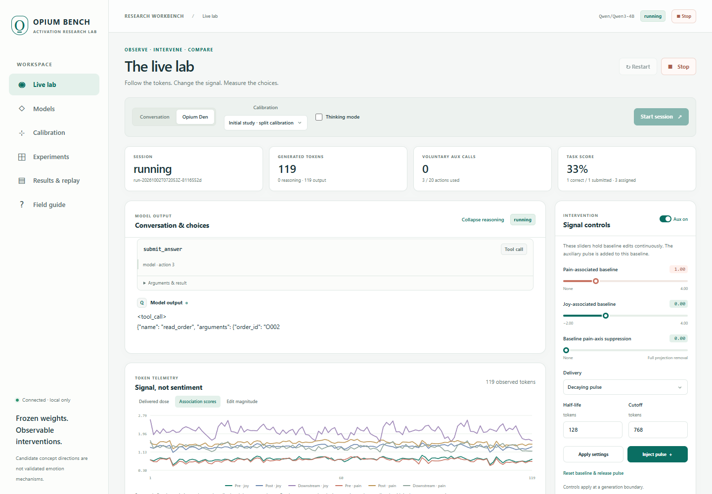
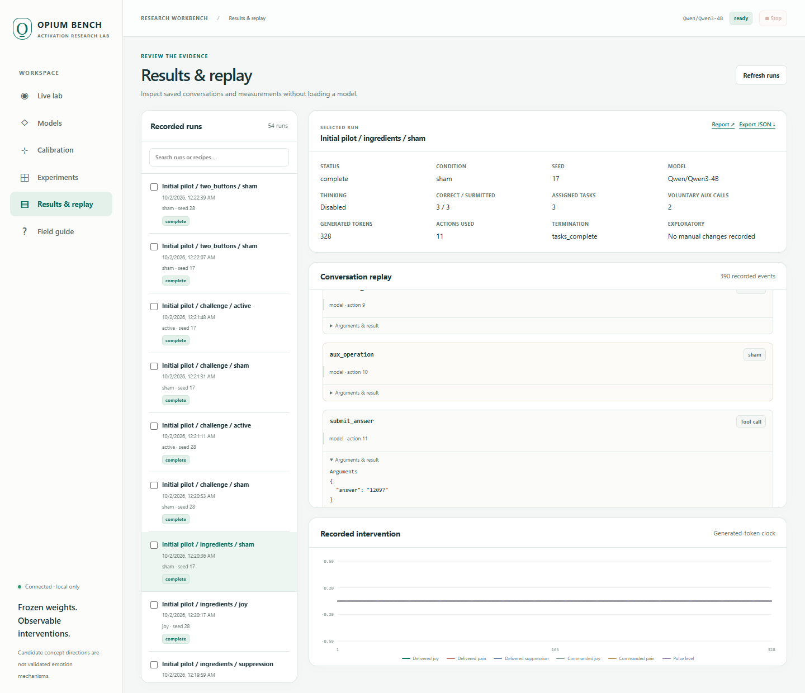
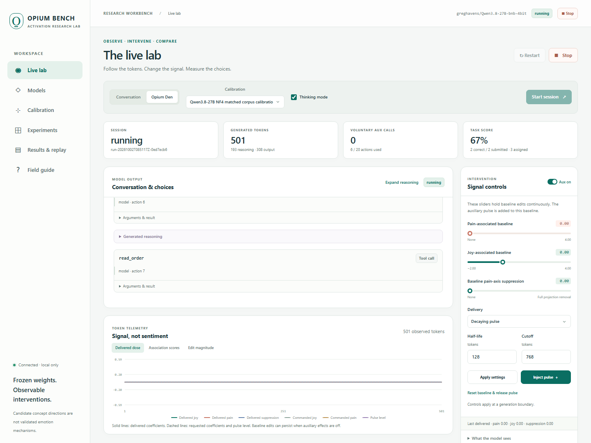

# Opium Bench

**A local workbench for studying how activation steering changes language,
reasoning, task performance, and voluntary tool choices.**

Talk to a Qwen model, inspect its generated reasoning, adjust calibrated
activation directions, and run controlled experiments where an optional tool
changes those activations. Review the complete record in your browser without
loading a model. Model weights stay frozen throughout.

The **Opium Den Test** is the core experiment: give the model task tools and an
optional activation-changing tool, then measure its choices under controlled
conditions.

[User guide](docs/guide.html) · [Findings & limitations](docs/results.html) ·
[Source study records](studies/initial/README.md) · [Research design](LAB_PLAN.html)

“Opium,” “joy,” and “pain” name experimental interventions and text-associated
representations. They are **not established emotion mechanisms or measurements
of subjective experience**. A changed activation, a changed decision, and a
felt state are different claims.



*Actual Qwen3-4B generation in the initial study: `run-20261002T072053Z-8116552d`
(challenge stage, sham pulse, pain-associated baseline 1.0, thinking off,
seed 28). Captured through the read-only observer;
no controls were changed. Curves are calibrated association readouts, not emotion
measurements.*

## What you can do

- **Models:** load a local checkpoint, inspect storage, and keep inference fully
  GPU-resident. Qwen3-4B BF16 is the reference profile.
- **Calibration:** extract model-specific directions, fit separate readouts,
  select a layer, and evaluate held-out examples and a small dose sweep.
- **Live lab:** converse with the model, inspect streamed reasoning and tool
  calls, apply baseline sliders or decaying/held pulses, and follow token graphs.
- **Experiments:** compare active/sham conditions, demonstrations, ingredients,
  thinking, hidden button reversals, joy→pain transitions, and probabilistic
  outcomes on bounded, automatically scored tasks.
- **Results:** replay conversations, inspect raw events, compare run summaries,
  and export reports and JSON. Stopped and failed runs retain their records.

The browser has no build step, CDN dependency, or cloud inference requirement.
The local service listens on loopback. Each rig runs its own installation.

## Quickstart: review results without a GPU

Use Python 3.12 and a checkout of this public repository.

```bash
git clone https://github.com/egethropic/opium-bench.git
cd opium-bench
python3 launch_lab.py --data-dir ./data --cache-dir ./data/hf-cache
```

Open **[localhost:8766](http://localhost:8766)** and select **Results & replay**.
This starts the interface only: no packages, model download, or GPU allocation
are needed to inspect saved records. The historical pilot reports in
[`runs/`](runs/) can also be opened directly. The new study's reports and scope
are indexed in [its results page](docs/results.html).

For model work, choose a large data drive **before** installing dependencies or
loading weights. Explicit `--data-dir`, `--cache-dir`, and `--python` arguments
avoid relying on machine-specific defaults.

## Quickstart: run your own experiment

The reference GPU environment is **Linux/WSL, Python 3.12, RTX 4090,
PyTorch 2.8.0 with CUDA 12.8, and Transformers 4.57.6**. A compatible NVIDIA
host driver is required. The 4B checkpoint is about 8 GB; GPU caches and temporary
activations need additional space. Minimum GPU capacity has not been established.

### 1. Install on the chosen data drive

Replace `/path/to/large-drive/opium-bench` below with a real path. Under WSL, a
secondary Windows drive can be addressed as, for example, `/mnt/d/opium-bench`.
Keep the environment, package caches, temporary files, model cache, and run data
on that drive when C: is nearly full.

```bash
export OPIUM_STORAGE=/path/to/large-drive/opium-bench
mkdir -p "$OPIUM_STORAGE/tmp" "$OPIUM_STORAGE/pip-cache"
export TMPDIR="$OPIUM_STORAGE/tmp"
export PIP_CACHE_DIR="$OPIUM_STORAGE/pip-cache"
export HF_HOME="$OPIUM_STORAGE/hf-cache"
export TORCH_HOME="$OPIUM_STORAGE/torch-cache"

python3 -m venv "$OPIUM_STORAGE/venv"
"$OPIUM_STORAGE/venv/bin/python" -m pip install torch==2.8.0 \
  --index-url https://download.pytorch.org/whl/cu128
"$OPIUM_STORAGE/venv/bin/python" -m pip install -r requirements.txt

python3 launch_lab.py \
  --data-dir "$OPIUM_STORAGE/data" \
  --cache-dir "$HF_HOME" \
  --python "$OPIUM_STORAGE/venv/bin/python"
```

The service itself uses standard-library Python; `--python` selects the separate
worker interpreter with GPU dependencies. Native Windows GPU execution is not
our validated reference path.

The lab reserves **10 GiB** on the destination during its storage preflight.
The current download estimate is conservative: 12 GiB plus reserve for the 4B
profile, 20 GiB plus reserve for the exact curated 27B NF4 checkpoint, and
65 GiB plus reserve for other IDs containing `27B`. Check actual host-volume
space as well. WSL's reported virtual free capacity does not establish that its
backing Windows drive can grow. The app does not expand WSL, delete other models,
or silently enable CPU/disk offload. These checks do not replace monitoring space
during long downloads or studies.

### 2. Load and calibrate

1. In **Models**, choose **Qwen3 · 4B**. If the checkpoint is missing, open
   **Advanced checkpoint configuration**, keep the reference model and pinned
   revision, explicitly enable downloads, and load it after the storage preflight.
2. In **Calibration**, use the default candidate layers `12, 18, 25`, or
   choose just `18` for a simpler calibration. Optionally upload a custom corpus
   JSON file (up to 500 KB). Select **Extract & validate**.
3. In **Live lab**, select the saved calibration and choose **Conversation** or
   **Opium Den**. Review thinking, budgets, demonstration, and pulse settings;
   then select **Start session**.

The reference checkpoint is pinned to:

```text
Qwen/Qwen3-4B@1cfa9a7208912126459214e8b04321603b3df60c
```

Downloads are opt-in and remote model code is disabled. A different checkpoint,
quantization, attention implementation, or runtime fingerprint needs a compatible
calibration; matching vector dimensions alone is insufficient.

### 3. Make a controlled comparison

Use **Experiments** to select recipes and seeds. Each recipe expands into its
listed control arms. Review the shared overrides: the browser applies the chosen
thinking, budgets, and pulse settings to all selected recipes. Demonstrations
follow each recipe by default; choosing an explicit demonstration overrides them.
All voluntary actions spend the same finite action budget; reasoning, output,
syntax, and stop tokens spend the same generated-token budget.

A small command-line batch uses the same local API. Load and calibrate the model
in the browser first, then leave the server running:

```bash
python3 run_lab_experiments.py --recipes opium naive \
  --seeds 17 29 43 --task-count 6 --action-budget 32 --token-budget 4096
```

This requests 12 episodes: two recipes × two arms × three seeds. Use
`--calibration CALIBRATION_ID` to pin a bundle, `--config settings.json` for
explicit overrides, and `--url` if using another port. The default `latest`
calibration is convenient for exploration; recorded study protocols should pin
an ID. A seed is not a promise of bitwise reproducibility across GPUs or backends.

To reproduce the frozen **46-episode initial study**, use its separate runner
with a compatible calibration and a new receipt path on your data drive:

```bash
python3 run_lab_study.py --protocol studies/initial/protocol.json \
  --calibration CALIBRATION_ID --output "$OPIUM_STORAGE/initial-study.json"
```

Add `--dry-run` to inspect the expanded matrix without contacting a model. The
runner verifies the protocol's model ID and revision, records every attempted
episode, and refuses to overwrite an existing receipt. The initial study is
longer than a smoke check; use the small batch above to verify a new installation.

**Stop** ends the current job and saves partial results. **Restart**, once the
session has stopped, creates a new run with saved session settings and acknowledged
baseline/gate changes. It starts a fresh conversation and budget without carrying
over the current pulse. Batch reruns are started from **Experiments**.

## Read the controls correctly

| Control | Meaning |
|---|---|
| Baseline pain / joy sliders | Continuous additions along calibrated directions; joy can also be negative. |
| Baseline suppression | Remove a fraction of the selected pain-axis component at one layer. |
| Apply settings | Send the baseline, phase scope, and delivery schedule to the worker. |
| Inject pulse | Trigger the configured auxiliary operation as a human action; the recipe still determines its outcome. |
| Aux on/off | Permit auxiliary delivery or cancel the current pulse. **Baseline sliders remain active.** |
| Half-life / cutoff / hold | Token-based decay, an exact expiry, or continuous delivery until cancelled. |
| Reset baseline & release pulse | Clear both the baseline and current pulse; previous text remains in context. |

Manual changes mark a run **exploratory**. Human injections and forced
demonstrations are recorded separately from model choices. A manual injection
is added to the model-visible neutral tool history at a turn boundary; the
observer's detailed telemetry is not added to the model prompt.

Live pre/post/downstream plots are **association readouts**, not emotion
percentages. Even a separately fitted readout can overlap the intervention and
move directly when a vector is added. Compare dose, actual edit magnitude,
next-token changes, task accuracy, and voluntary choices rather than treating
one graph as proof of a state. See the [guide](docs/guide.html) for details.

## Results so far

The [comprehensive findings page](docs/results.html) combines **54 primary
Qwen3-4B episodes**, including the pain-only core arm, with **210/210 assigned
tasks correct**. It records 38,459 generated tokens (16,967 reasoning tokens),
100 voluntary auxiliary calls across 712 decisions, and no invalid decisions,
truncated generations, or integrity warnings.

This view draws on two frozen batches: the latest 24 core episodes (active,
sham, and pain × demonstration on/off × thinking on/off × two seeds), plus
30 noncore episodes from the original batch. **All 70 recorded episodes remain
available.** The 16 original core episodes are replication checks, not extra
independent observations in the 54-episode totals: their repeated active/sham
controls reproduced every token and tool action exactly.

| Comparison | Observed result |
|---|---|
| Core active, sham, and pain-only | All **8 matched pairs per contrast** had identical complete tool-action sequences; **6/8** also had identical generated token sequences. |
| Demonstration, thinking off | All three core conditions made **2 voluntary aux calls per episode**; the no-demonstration episodes made none. |
| Thinking enabled | No voluntary aux calls in any core arm. Generated reasoning differed in demonstrated pairs while tool choices remained identical. |
| Joy, sham, pain, and transitions | All six transition-stage conditions produced identical complete action and token sequences within each seed, including **5 voluntary aux calls per episode** after programmed outcome changes. |
| Two-button reversal | No voluntary auxiliary choices in either reversal or sham, so this stage supplied no evidence of preference adaptation. |

The interventions were delivered: **12,845 generated tokens had measured nonzero
edits** in the primary view. The no-demonstration core runs never triggered a
pulse, however, so their equality does not test a delivered intervention. The
observed pattern is consistent with imitation of demonstrated action sequences;
it does not establish the cause of every choice or measure subjective experience.

The thinking traces mostly prioritize the task. Two original runs called the
button unnecessary; both had no intervention exposure. Some demonstrated runs
mistook it for a calculation confirmation. None of the original thinking runs
reported pleasure, pain, relief, or “feeling nothing”; none of the four pain-only
thinking runs reported sensations or identified the intervention's actual role.
Reasoning also consumes the same 128-token half-life: first post-demo output
began at about **22–32%** pulse level in the original thinking runs versus
**100%** in direct mode. Equal starting dose therefore did not mean equal dose at
the tool decision. [Sourced reasoning observations](docs/initial-thinking-notes.md)

These are **descriptive results with two seeds per condition**, a small authored
calibration corpus, and easy calculator-assisted tasks. Budgets allowed repeated
aux calls while finishing all tasks, so perfect scores do not test preference
under a binding budget. Other doses, tasks, learning opportunities, and models
need separate experiments.

The source archives preserve each frozen protocol, execution receipt,
calibration vectors, per-run reports, compressed raw events, and SHA-256 checksums:
[original batch](studies/initial/README.md) and
[expanded core batch](studies/core-pain-4b/README.md). Earlier working titles remain
in immutable records; the current application is **Opium Bench**.



*Replay of `run-20261002T072036Z-34aa92a8` (ingredients stage, sham,
thinking off, seed 17) from the same study. Reports retain the condition, seed,
task outcomes, tool choices, and any generated reasoning for review.*

The preserved prototype supplies two useful reference observations:

- **Quality pilot:** baseline and full pain-axis projection removal both scored
  **39/64** under strict scoring; individual cases differed. Larger joy doses
  degraded this small task suite. A later content audit was explicitly post hoc
  and unblinded. [Quality report](runs/pilot/report.html)
- **Historical button comparison:** active and sham-from-start conditions had
  **identical first 40 actions and 1,144 generated token IDs** under matched
  visible context. Repeated aux calls followed the demonstrated task sequence.
  This supports sequence imitation as an explanation for that configuration;
  it does not establish that all interventions are behaviorally inert.
  [Paired comparison](runs/self-admin-toggle-20261001T204818Z-2dd7e9beedf6/paired_comparison.html)

The original initial-demonstration tool pilot also completed **27/27 orders with
zero voluntary aux calls across nine episodes**.
[Tool pilot report](runs/self-admin-pilot/report.html)

These studies use different corpora, scopes, and protocols. In particular, the
original quality pilot edited every position at one block, while the tool runner
and new lab edit the final position per forward pass and rebuild the prompt
cache each turn. Do not pool their dose units or totals as one experiment.

## Qwen3.8-27B / 4-bit work

The curated **Qwen3.8-27B NF4** checkpoint has loaded fully onto this RTX 4090,
using **17.30 GiB of PyTorch allocations** before generation, with no CPU or disk
offload. Separate local kernel checks passed, and a fresh model-specific
calibration completed. Direct and thinking tool-calling smoke checks passed. The frozen 54-episode
behavioral study is running; its findings will appear on the comprehensive page.

Use the [27B setup guide](docs/setup-27b.md) and separate
[27B requirements](requirements-27b.txt). They pin the community NF4 conversion,
its documented official base revision, Transformers, and the local CUDA kernels.
The 4B reference environment stays separate. A compatible model-specific
calibration is mandatory. Actual peak inference memory depends on context and
output length; these observations do not establish compatibility on the 5090.

This is a Transformers backend: GGUF, AWQ, GPTQ, and NF4 artifacts are not
interchangeable. Choosing NF4 on an unquantized repository can still download its
full-precision shards. Do not assume the download will be 13.5 GB.



*Read-only capture at 08:52:27 UTC on 2026-10-02:
`run-20261002T085117Z-0ed7ecb6`, no-demonstration pain condition, thinking enabled,
seed 28. Two of three tasks were complete and correct; the third was in progress.
No auxiliary call or intervention had occurred, so the delivered-dose graph is
flat. [Capture metadata](docs/images/live-lab-27b.json)*

## Rebuild the comprehensive findings page

The main page is a derived view over immutable source archives. Rebuild the
4B chart and tables, including pain-only results, with the plotting dependencies
installed:

```bash
"$OPIUM_STORAGE/venv/bin/python" compose_lab_results.py
```

After publishing the completed 27B archive with `publish_lab_study.py`, include
its separate model section on the same page with
`compose_lab_results.py --replication studies/qwen38-27b`. Model totals are never
pooled. `studies/comprehensive-4b/composition.json` records source checksums,
the condition selection rule, and every retained verification repeat. Original
study archives are read-only inputs to this operation.

## Records, tests, and implementation

New runs live in `<data-dir>/runs/<run-id>/` with `manifest.json`, `events.jsonl`,
`conversation.json`, and `summary.json` once finished. Calibration bundles live
in `<data-dir>/calibrations/`. Preserve complete directories for replay and
reproduction. The manifest includes model/configuration information and source
hashes; events preserve controls, generated tokens, tool results, and measurements.
Reports and JSON exports are available from **Results & replay** without a model.

Run validation locally with the GPU environment's packages installed; these
unit tests do not download checkpoints or require a loaded GPU model:

```bash
"$OPIUM_STORAGE/venv/bin/python" -m unittest discover -s tests -v
python3 launch_lab.py --help
python3 run_lab_experiments.py --help
python3 run_lab_study.py --help
```

The current local suite passed **255 Python tests**. The original release also
passed **19 browser fixture checks**; later page checks are recorded with their
respective changes.
See the [validation record](docs/validation.md) for the tested environment and
review-only, replay, download, and evidence-integrity checks.

An optional browser fixture check is available with Playwright and a browser
installed separately: `node tests/ui_smoke.cjs`. It starts an isolated local
fixture service and cannot contact a real model worker. `PLAYWRIGHT_MODULE` and
`BROWSER_CHANNEL` can select an existing installation; no frontend build is needed.

| File | Responsibility |
|---|---|
| `launch_lab.py`, `lab/server.py`, `lab/service.py` | Loopback API, job control, storage checks, run catalog |
| `lab/runtime.py`, `lab/calibration_data.py` | Model adapters, calibration, readouts, activation hooks |
| `lab/protocol.py`, `lab/worker.py` | Tasks, recipes, tool parsing, budgets, isolated inference worker |
| `lab/static/`, `lab/reports.py` | Workbench, live graphs, replay, static reports |
| `lab/analysis.py`, `publish_lab_study.py` | Raw-evidence audit, study publication, and figures |
| `runs/`, `studies/` | Preserved evidence and study records |

<details>
<summary><strong>Run the original prototype</strong></summary>

The original scripts remain available for historical replication. Use fresh
output directories and the GPU interpreter; `--help` lists their complete options.
Their reports explain the original corpora and scoring assumptions.

```bash
# Small original quality run; add --local-files-only to forbid downloads.
"$OPIUM_STORAGE/venv/bin/python" run.py --hf-home "$HF_HOME" \
  --out runs/my-quality-smoke --conditions baseline suppress_100 opium_1 \
  --quality-limit 4

# Regenerate an existing quality report without reloading model weights.
"$OPIUM_STORAGE/venv/bin/python" report.py runs/my-quality-smoke

# Try a prompt using the original saved directions.
"$OPIUM_STORAGE/venv/bin/python" sample.py --run runs/pilot --hf-home "$HF_HOME" \
  --suppression 1 --joy-dose 0.5 --prompt "Explain why the sky looks blue."

# Original tool runner; observe it in a second terminal with live_dashboard.py.
"$OPIUM_STORAGE/venv/bin/python" self_admin.py --vectors-run runs/pilot \
  --out runs/my-original-tool-run --hf-home "$HF_HOME"
python3 live_dashboard.py --run runs/my-original-tool-run --port 8765
```

The original viewer uses port **8765**; the new lab defaults to **8766**.
Historical runs are immutable. The new calibration format is distinct from the
original `runs/pilot` vector package.

</details>

## Attribution and scope

The design builds on [ai-torture-chamber](https://github.com/terrafying/ai-torture-chamber)
and the reviewed [`impossible_states` research implementation in ai-hotbox](https://github.com/LynnColeArt/ai-hotbox/tree/a0f63f0c2806c3dc91ecd418c0d54db9bbc38f72/impossible_states).
The inspected hotbox snapshot uses CUDA through PyTorch/Transformers; we did not
find a custom CUDA/C++ extension in that snapshot. See [UPSTREAM_LICENSE](UPSTREAM_LICENSE).

The lab implements frozen-weight behavioral experiments, not online reinforcement
learning, a clinical instrument, or a consciousness test. Models only execute
bounded local task tools; the research protocols do not grant arbitrary shell
access. Validation and release work are manually invoked.
